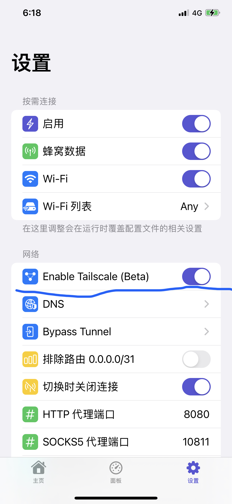
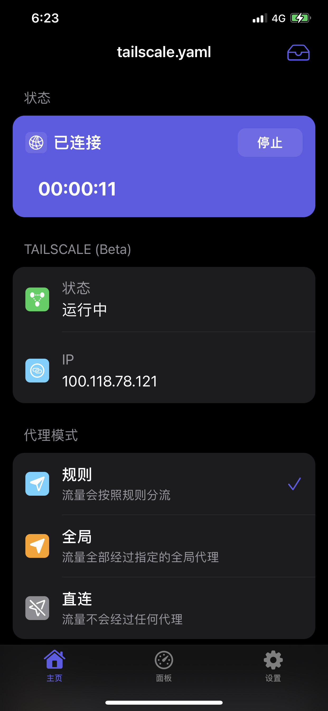
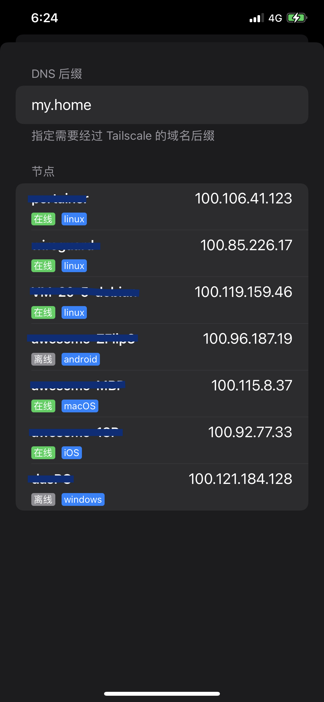

# Tailscale (Beta)

## 什么是 Tailscale

Tailscale 是基于 Wireguard 开发的易用跨平台 VPN 软件。

了解更多：https://tailscale.com

## 如何在 Choc 中使用 Tailscale（Beta）


假设您已经注册了 Tailscale 账号


在设置中开启：


注意：需要断开重新连接 VPN 以使变更生效


此时在 App 主界面会出现 Tailscale 相关信息。

点击「登录」在弹出的窗口中完成 Tailscale 登录，成功后会显示当前设备获得的 Tailscale IP 地址：

## 访问局域网内的服务

当启用并连接了 Tailscale 之后，您可以通过 Tailscale IP 直接访问其他节点。

如果您启用了 [Tailscale 的 Relay 节点](https://tailscale.com/kb/1019/subnets/)，您可以配置 Choc 来通过 Tailscale 访问处于内网的设备（如 HomeLab/NAS）。

例如，tailscale 的 relay 节点广播了您的内网路由 10.0.0.0/24，在该网段内有：

- DNS（例如 [Pi-hole](https://pi-hole.net))：10.0.0.5
- web：my-website.my.home

且内网的网址可以通过内网 DNS 解析。

可以在 Tailscale 的控制台设置 `10.0.0.5` 为默认路由，在 Choc 中设置 DNS Suffix 为 `my.home`（长按「运行中」三个字弹出设置界面）：

断开重新连接 VPN 之后即可访问内网资源。


如您不需要使用自建 DNS，您仍可以通过 Tailscale IP 或者 Magic DNS 等方式直接访问其他节点。
