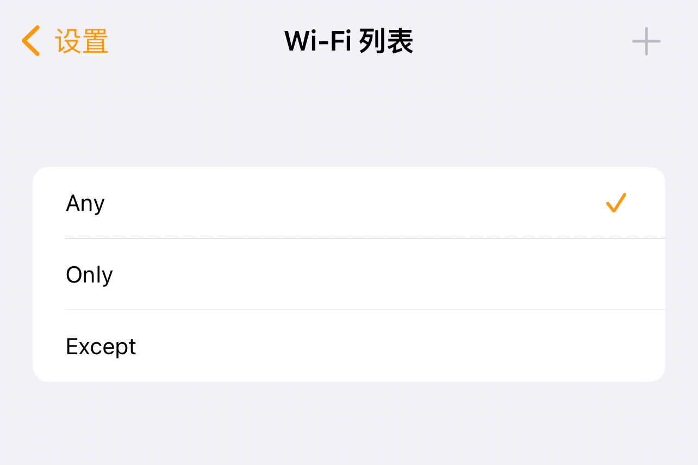

# 按需连接配置

Choc 支持在Clash配置文件中添加字段以支持 iOS的”按需连接“ 特性。


自 Choc 1.2.0 以来，已经支持在设置中通过 UI 直接配置。


## 使用图形化界面配置

.png>)

### Wi-Fi 列表配置说明



可通过右上角 + 添加SSID。在 `Any` 模式下无需添加SSID。

* `any` : 任何 Wi-Fi 网络下均自动连接
* `only` : 仅在 `ssid-list` 中的 Wi-Fi 下连接
* `except` : 当处于 `ssid-list` 中的 Wi-Fi 下时断开连接


## 通过配置文件配置

### 配置片段示例

```yaml
ios-config:
  ondemand-rules:
    cellular: true
    wifi: true
    ssid-match: only
    ssid-list: ["ssid"]
```


### 配置说明

#### cellular

可选值：`true` / `false`

当设置为 `true` 时，会在蜂窝网络时自动连接；设置为`false` ，会在蜂窝网络时自动断开。

#### wifi

可选值：`true` / `false`

当设置为 `true` 时，会在连接到 Wi-Fi时自动连接；设置为`false` ，会在连接到 Wi-Fi 时自动断开。

#### ssid-match

可选值：

&#x20;   `only` : 仅在 `ssid-list` 中的 Wi-Fi 下连接；

&#x20;   `except` : 当处于 `ssid-list` 中的 Wi-Fi 下时断开连接；

&#x20;   `any` : 任何 Wi-Fi 网络下均自动连接。
